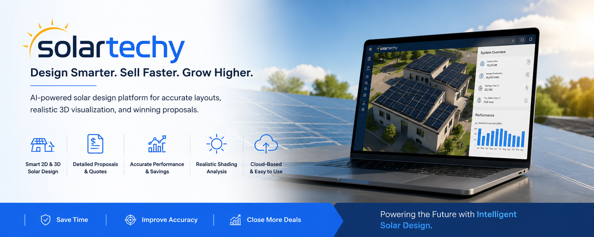
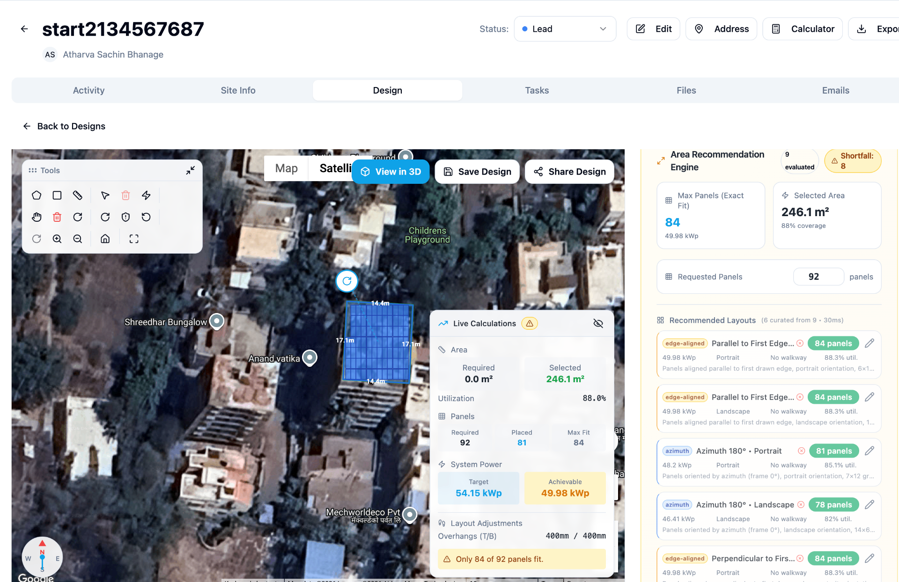

# SolarTechy – AI Powered Solar Design Software | 2D & 3D Solar Layout Platform

## SolarTechy – Design Smarter. Sell Faster. Grow Higher.

Welcome to **SolarTechy**, an AI-powered solar design and proposal platform built for solar installers, EPC companies, solar consultants, and homeowners.

🌞 Create accurate rooftop solar layouts in minutes  
⚡ Generate realistic 3D solar visualizations  
📐 Build AutoCAD-like solar designs without CAD knowledge  
📊 Calculate solar performance, savings, and utilization  
🧾 Generate professional solar quotations and proposals  
☁️ Cloud-based solar planning software for modern solar businesses  

👉 Website: https://solartechy.in/

---

# Why SolarTechy?

SolarTechy simplifies the entire solar design workflow.

Instead of spending hours using complicated CAD tools or manual calculations, SolarTechy helps you:

- Design rooftop solar systems faster
- Improve proposal accuracy
- Generate professional quotations instantly
- Create realistic 3D solar visualizations
- Analyze shading and solar production
- Increase solar sales conversion

Whether you are a small solar installer or a growing solar EPC company, SolarTechy helps you scale your solar business efficiently.

---

# Features

## ✅ Smart 2D & 3D Solar Design

Create detailed rooftop solar panel layouts directly on satellite maps.

Features include:

- Exact rooftop measurements
- Panel placement optimization
- Multiple layout recommendations
- Parallel and azimuth-based layouts
- Real-time panel calculations
- Utilization analysis

---

## ✅ Realistic 3D Solar Visualization

Visualize rooftop solar systems in immersive 3D.

SolarTechy helps customers understand exactly how their solar installation will look before installation begins.

### Watch Demo

🎥 Video:
https://youtu.be/ug81Gsv_fnc

---

## ✅ AutoCAD-Like Solar Design Without CAD Knowledge

Generate professional solar layouts without needing AutoCAD expertise.

### Watch Tutorial

🎥 Video:
https://youtu.be/lh3HXcbpe80

---

## ✅ Detailed Solar Proposals & Quotations

Generate professional solar proposals including:

- System sizing
- Energy generation
- Savings estimation
- ROI calculations
- Bill of materials
- Solar panel layout visuals

Perfect for:

- Solar EPC companies
- Residential solar installers
- Commercial solar projects
- Solar consultants

---

## ✅ Accurate Solar Performance Analysis

SolarTechy helps estimate:

- Annual solar production
- Solar savings
- Carbon offset
- Panel utilization
- Rooftop efficiency

Designed for accurate solar planning and customer confidence.

---

# SolarTechy Video Tutorials

## Intro Tutorial

🎥 Watch:
https://youtu.be/RnM2OlHozTk

---

## Create Your First 3D Solar Panel Design – Part 2

🎥 Watch:
https://youtu.be/3yT3Lt6dMh0

---

# Best Solar Design Software in India

If you are searching for:

- solar design software
- solar rooftop design software
- solar proposal software
- solar quotation software
- solar CAD software
- solar panel layout software
- AI solar software
- solar EPC software
- solar installer software
- rooftop solar planning tool
- 3D solar design platform

then **SolarTechy** is built for you.

---

# SEO Keywords

SolarTechy, Solar Techy, SolarTech, Solar Tech, AI Solar Design Software, Solar Proposal Software India, Rooftop Solar Design Platform, Solar CAD Alternative, 3D Solar Visualization, Solar Panel Layout Tool, Solar EPC Platform, Solar Installer Software, Solar Quotation Generator, Solar Rooftop Planner, Solar Sales Software

---

# About SolarTechy

SolarTechy is focused on making solar planning faster, smarter, and more accessible.

Our mission is to help accelerate solar adoption through intelligent automation and easy-to-use solar design tools.

We believe solar companies should spend less time designing and more time growing.

---

# Connect With SolarTechy

🌐 Website: https://solartechy.in/  
📺 YouTube: https://www.youtube.com/@solartechy  
☀️ Platform: AI Powered Solar Design & Proposal Software

---

# Getting Started

Visit:

👉 https://solartechy.in/

Start designing your first solar rooftop system today.

---

# Screenshots

## SolarTechy Dashboard

---

## Rooftop Solar Layout

---

# Tags

#SolarTechy  
#SolarTech  
#SolarDesign  
#SolarSoftware  
#SolarProposal  
#SolarCAD  
#SolarRooftop  
#SolarInstaller  
#SolarEPC  
#RenewableEnergy  
#SolarEnergy  
#3DSolarDesign  
#AISolar  
#GreenEnergy  
#SolarPlanning  
